<div align="center">


<p>
  
</p>

<p>
  <a href="mailto:nmissinadia@gmail.com">
    
  </a>
  <a href="https://www.linkedin.com/in/nadia-nmissi/">
    
  </a>
  <a href="https://github.com/nmissi-nadia">
    
  </a>
  <a href="tel:+212600319784">
    
  </a>
</p>


</div>

---

## 🌟 À Propos de Moi

```javascript
const nadia = {
    role: "Développeuse Full Stack",
    formation: "YouCode (UM6P) - Développement Full Stack Web",
    location: "Safi, Maroc 🇲🇦",
    passion: ["Innovation technologique", "Architecture logicielle", "Design UX/UI"],
    currentFocus: "Applications web scalables et performantes",
    funFact: "Je transforme le café ☕ en code 💻",
    lifePhilosophy: "Apprendre, Créer, Innover, Répéter 🔄"
};
```

<div align="center">
  
### 🎯 Mon Parcours

```mermaid
timeline
    title Mon Parcours Académique & Professionnel
    2020 : Baccalauréat Sciences Mathématiques B BIOF
         : Lycée Technique Al Khawarizmi, Safi
    2020-2024 : Licence Sciences Mathématiques et Informatiques
              : Faculté Polydisciplinaire Safi
    2024-2025 : Formation Développement Full Stack Web
              : YouCode (UM6P), Safi
    2025 : Stage OCP Maintenance Solutions
         : Développement Web (Mai - Juillet)
```

</div>



---

## 🛠️ Stack Technologique

<div align="center">

### 💻 Langages de Programmation

<p>
  
  
  
  
  
  
</p>

### 🎨 Frontend Development

<p>
  
  
  
  
</p>

### ⚙️ Backend Development

<p>
  
  
  
  
</p>

### 🗄️ Bases de Données

<p>
  
  
</p>

### 🔧 Outils & Méthodologies

<p>
  
  
  
  
  
  
</p>

### 💻 Systèmes & Virtualisation

<p>
  
  
  
  
  
</p>

</div>

---

## 🚀 Projets Réalisés

<div align="center">

<table>
<tr>
<td width="50%">

### 🏥 TeleCare
#### Plateforme de Téléexpertise Médicale

<p align="center">
  
  
  
</p>

Application web médicale facilitant la collaboration entre infirmiers et médecins généralistes. Gestion complète des patients, consultations et actes techniques.

**🔑 Fonctionnalités:**
- 👥 Gestion des patients
- 📋 Suivi des consultations
- 💉 Gestion des actes techniques
- 🔐 Authentification sécurisée

</td>
<td width="50%">

### 💼 TalentMatcher
#### Plateforme de Recrutement

<p align="center">
  
  
  
</p>

Plateforme complète de recrutement avec gestion des profils, recherche d'offres avancée et tableau de bord personnalisé.

**🔑 Fonctionnalités:**
- 🔍 Recherche avancée d'offres
- 📝 Gestion des candidatures
- 📊 Tableau de bord interactif
- 💼 Interface multi-rôles

</td>
</tr>

<tr>
<td width="50%">

### 🏢 LiqaaSpace
#### Gestion de Salles de Réunion

<p align="center">
  
  
  
</p>

Solution complète de réservation et gestion des salles de réunion avec architecture moderne.

**🔑 Fonctionnalités:**
- 📅 Réservation en temps réel
- 🎯 Analyse UML complète
- 🔄 API REST structurée
- ✅ Tests et déploiement

**📍 Stage:** OCP Maintenance Solutions

</td>
<td width="50%">

### 🛒 SmartShop
#### Application de Gestion Commerciale B2B

<p align="center">
  
  
  
</p>

Application web B2B complète avec gestion des clients, produits, commandes et paiements fractionnés.

**🔑 Fonctionnalités:**
- 💰 Remises progressives
- 💳 Paiements fractionnés
- 📈 Suivi des transactions
- 🔐 Spring Security

[🔗 Voir le projet](https://github.com/nmissi-nadia/SmartShop)

</td>
</tr>

<tr>
<td width="50%">

### ⚽ Ultimate Team Manager
#### Gestionnaire EA FC 25

<p align="center">
  
  
  
</p>

Application web interactive pour créer et gérer des formations tactiques et équipes de joueurs.

**🔑 Fonctionnalités:**
- ⚙️ Formations personnalisables
- 👤 Gestion des joueurs
- 🎮 Interface interactive
- 📱 Design responsive

[🔗 Voir le projet](https://github.com/nmissi-nadia/ultimate-team-manager)

</td>
<td width="50%">

### 💪 ENERGYM
#### Gestion de Salle de Sport (V2)

<p align="center">
  
  
  
</p>

Solution complète pour gérer les abonnements, plannings et activités d'une salle de sport.

**🔑 Fonctionnalités:**
- 📋 Gestion des abonnements
- 📅 Planning des activités
- 👥 Suivi des membres
- 📊 Statistiques complètes

[🔗 Voir le projet](https://github.com/nmissi-nadia/ENERGYM)

</td>
</tr>
</table>

</div>

---

## 📊 Statistiques GitHub

<div align="center">
  


</div>

---

## 🏆 Expérience Professionnelle

<div align="center">

```diff
+ 🏢 OCP Maintenance Solutions
+ 📅 Stage en Développement Web (19/05/2025 - 18/07/2025)
+ 🚀 Projet: LiqaaSpace - Plateforme de Réservation de Salles
```

</div>

**🎯 Contributions clés:**
- ✅ Développement frontend avec **React.js**
- ✅ Développement backend avec **Laravel** (Eloquent ORM, API REST)
- ✅ Analyse fonctionnelle et conception **UML**
- ✅ Implémentation de tests et déploiement

---

## 🌍 Langues

<div align="center">

| Langue | Niveau |
|--------|--------|
| 🇲🇦 **Arabe** | Courant |
| 🇫🇷 **Français** | Intermédiaire |
| 🇬🇧 **Anglais** | Intermédiaire |

</div>

---

## 🎨 Centres d'Intérêt

<div align="center">

<table>
<tr>
<td align="center" width="25%">

<br><b>Nouvelles Technologies</b>
</td>
<td align="center" width="25%">

<br><b>Découverte des Cultures</b>
</td>
<td align="center" width="25%">

<br><b>Cuisine</b>
</td>
<td align="center" width="25%">

<br><b>Musique</b>
</td>
</tr>
</table>

</div>

---

## 💭 Citation du Moment

<div align="center">


</div>

---

## 📬 Me Contacter

<div align="center">

<p>Je suis toujours ouverte aux opportunités de collaboration et aux projets innovants ! 🚀</p>

<p>
  <a href="mailto:nmissinadia@gmail.com">
    
  </a>
</p>

<p>
  <a href="https://www.linkedin.com/in/nadia-nmissi/">
    
  </a>
</p>

<p>
  <a href="https://github.com/nmissi-nadia">
    
  </a>
</p>

<p>
  
</p>

</div>

---

<div align="center">


### ⭐ Si mes projets vous plaisent, n'hésitez pas à les star ! ⭐

<p>
  
</p>

**💜 Fait avec passion par Nadia NMISSI**

</div>
